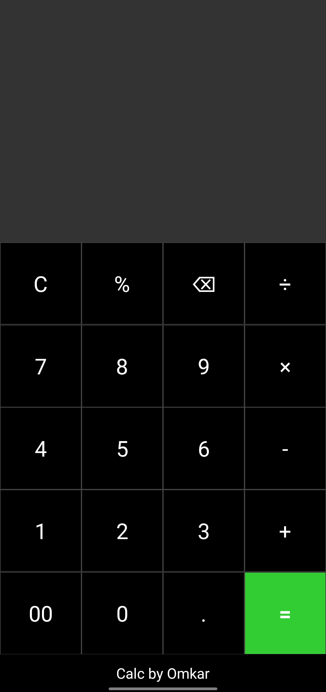

# React Native Calculator App (Android)

This is a simple calculator application built using React Native, designed exclusively for Android devices. The app provides basic arithmetic functionalities with an intuitive user interface.

## Features

- Perform basic arithmetic operations:
  - Addition (`+`)
  - Subtraction (`-`)
  - Multiplication (`×`)
  - Division (`÷`)
- Clear all inputs with a single tap (`C` button).
- Smooth performance optimized for Android.
- User-friendly design and responsive interface.

## Screenshots



## Installation

### Prerequisites

Ensure the following are installed and set up on your system:

- [Node.js](https://nodejs.org/)
- [npm](https://www.npmjs.com/) or [Yarn](https://yarnpkg.com/)
- [React Native CLI](https://reactnative.dev/docs/environment-setup)
- [Android Studio](https://developer.android.com/studio) (for Android emulator or USB debugging)

### Steps to Run

1. **Clone the Repository**
   ```bash
   git clone https://github.com/Omkar-R-Mundhe/Calculator_App.git
   cd react-native-calculator
   ```
2. **Install Dependencies**
   ```bash
   npm install
   ```
3. **Start the Metro Bundler**
   ```bash
   npx react-native start
   ```
4. **Run on Android Device or Emulator**

   - **For Emulator:** Start an Android Virtual Device (AVD) from Android Studio.
   - **For Physical Device:** Enable USB debugging and connect your Android device.

5. **Run the app:**
   ```bash
   npx react-native run-android
   ```